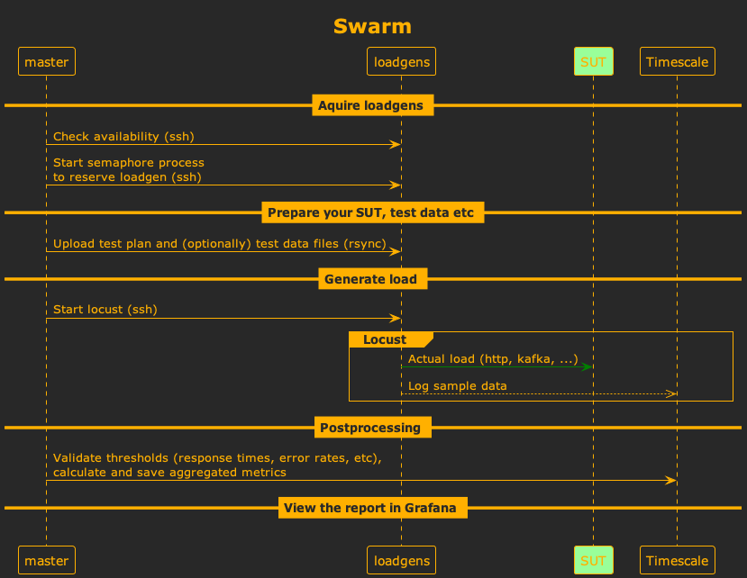

[](https://pypi.org/project/locust-swarm/)
[](https://pypi.org/project/locust-swarm/)
[](https://github.com/SvenskaSpel/locust-swarm/actions?query=workflow%3ATests)

# Swarm

Swarm is a script for automating distributed [Locust](https://github.com/locustio/locust) runs, using [rsync](https://linux.die.net/man/1/rsync) and [ssh](https://linux.die.net/man/1/ssh).

It can be run on your local Linux/MacOS machine and uses SSH tunnels to help work around any network/firewall issues that might otherwise prevent workers from sending data to the master.

It also implements a locking system that prevents multiple users from launching load tests on the same load generators at the same time, which is useful if you have a shared set of load generators.

## Installation

On the master:

```
pip install locust-swarm
```

On the loadgens:

```
pip install locust
```

## Usage

```
usage: swarm [-h] [-f LOCUSTFILE] --loadgen-list LOADGEN_LIST [--loadgens LOADGENS] [--processes PROCESSES] [--selenium] [--playwright] [--test-env TEST_ENV] [--loglevel LOGLEVEL] [--port PORT] [--remote-master REMOTE_MASTER] [--extra-files EXTRA_FILES [EXTRA_FILES ...]] [--version]

A tool for automating distributed locust runs using ssh.

Example: swarm -f test.py --loadgen-list loadgen1.domain.com,loadgen2.domain.com --users 50

options:
  -h, --help            show this help message and exit
  -f LOCUSTFILE, --locustfile LOCUSTFILE
  --loadgen-list LOADGEN_LIST
                        A comma-separated list of ssh servers on which to launch locust workers
  --loadgens LOADGENS, -l LOADGENS
                        Number of servers to run locust workers on. Defaults to -1, meaning all of them.
  --processes PROCESSES
                        This is passed on to locust unchanged and determines the number of worker processes per load generator.
  --selenium            Start selenium server on load gens for use with locust-plugins's WebdriverUser
  --playwright          Set LOCUST_PLAYWRIGHT env var for workers
  --test-env TEST_ENV   Pass LOCUST_TEST_ENV to workers (in case your script needs it *before* argument parsing)
  --loglevel LOGLEVEL, -L LOGLEVEL
                        Use DEBUG for tracing issues with load gens etc
  --port PORT
  --remote-master REMOTE_MASTER
                        An ssh server to use as locust master (default is to run the master locally). This is useful to prevent interrupting the load test if your workstation gets disconnected/goes to sleep.
  --extra-files EXTRA_FILES [EXTRA_FILES ...]
                        A list of extra files or directories to upload. Space-separated, e.g. --extra-files testdata.csv *.py my-directory/
  --version, -V         Show program's version number and exit

Any parameters not listed here are forwarded to locust master unmodified, so go ahead and use things like --users, --host, --run-time, ...

Swarm config can also be set using config file (~/.locust.conf, locust.conf, ~/.swarm.conf or swarm.conf).
Parameters specified on command line override env vars, which in turn override config files.
```


## Example run

```
~ swarm --loadgen-list perftest03 -t 10 -c 10 -f examples/locustfile.py -H https://example.com
[2019-09-20 13:46:09,885] lafp-mac-JG5J/INFO/root: Waiting for workers to be ready, 0 of 2 connected
[2019-09-20 13:46:10,889] lafp-mac-JG5J/INFO/root: Waiting for workers to be ready, 0 of 2 connected
[2019-09-20 13:46:11,891] lafp-mac-JG5J/INFO/root: Waiting for workers to be ready, 0 of 2 connected
[2019-09-20 13:46:12,195] perftest03/INFO/locust.main: Starting Locust 0.11.1
[2019-09-20 13:46:12,195] perftest03/INFO/locust.main: Starting Locust 0.11.1
[2019-09-20 13:46:12,322] lafp-mac-JG5J/INFO/locust.runners: Client 'perftest03_5ac395b244f3497796a6928e218da7ea' reported as ready. Currently 1 clients ready to swarm.
[2019-09-20 13:46:12,323] lafp-mac-JG5J/INFO/locust.runners: Client 'perftest03_09770e3ada2c47138ffabc5b7af1a25f' reported as ready. Currently 2 clients ready to swarm.
[2019-09-20 13:46:12,896] lafp-mac-JG5J/INFO/locust.runners: Sending hatch jobs to 2 ready clients
[2019-09-20 13:46:12,897] lafp-mac-JG5J/INFO/locust.main: Run time limit set to 10 seconds
[2019-09-20 13:46:12,897] lafp-mac-JG5J/INFO/locust.main: Starting Locust 0.11.1
 Name                                                          # reqs      # fails     Avg     Min     Max  |  Median   req/s
--------------------------------------------------------------------------------------------------------------------------------------------
--------------------------------------------------------------------------------------------------------------------------------------------
 Total                                                              0     0(0.00%)                                       0.00

[2019-09-20 13:46:12,916] perftest03/INFO/locust.runners: Hatching and swarming 5 clients at the rate 0.5 clients/s...
[2019-09-20 13:46:12,916] perftest03/INFO/locust.runners: Hatching and swarming 5 clients at the rate 0.5 clients/s...
 Name                                                          # reqs      # fails     Avg     Min     Max  |  Median   req/s
--------------------------------------------------------------------------------------------------------------------------------------------
--------------------------------------------------------------------------------------------------------------------------------------------
 Total                                                              0     0(0.00%)                                       0.00

 Name                                                          # reqs      # fails     Avg     Min     Max  |  Median   req/s
--------------------------------------------------------------------------------------------------------------------------------------------
 POST /authentication/1.0/getResults                                4     0(0.00%)      69      65      76  |      65    0.00
--------------------------------------------------------------------------------------------------------------------------------------------
 Total                                                              4     0(0.00%)                                       0.00

...

[2019-09-20 13:46:22,901] lafp-mac-JG5J/INFO/locust.main: Time limit reached. Stopping Locust.
 Name                                                          # reqs      # fails     Avg     Min     Max  |  Median   req/s
--------------------------------------------------------------------------------------------------------------------------------------------
 POST /authentication/1.0/getResults                               16     0(0.00%)      67      65      76  |      66    1.60
--------------------------------------------------------------------------------------------------------------------------------------------
 Total                                                             16     0(0.00%)                                       1.60

[2019-09-20 13:46:22,919] perftest03/INFO/locust.runners: All locusts hatched: WebsiteUser: 5
[2019-09-20 13:46:22,919] perftest03/INFO/locust.runners: Got quit message from master, shutting down...
[2019-09-20 13:46:22,919] perftest03/INFO/locust.runners: Got quit message from master, shutting down...
[2019-09-20 13:46:22,920] perftest03/INFO/locust.main: Shutting down (exit code 0), bye.
[2019-09-20 13:46:22,920] perftest03/INFO/locust.main: Shutting down (exit code 0), bye.
[2019-09-20 13:46:22,920] perftest03/INFO/locust.main: Cleaning up runner...
[2019-09-20 13:46:22,921] perftest03/INFO/locust.main: Running teardowns...
[2019-09-20 13:46:22,920] perftest03/INFO/locust.main: Cleaning up runner...
[2019-09-20 13:46:22,920] perftest03/INFO/locust.main: Running teardowns...
[2019-09-20 13:46:22,955] lafp-mac-JG5J/INFO/locust.runners: Client 'perftest03_5ac395b244f3497796a6928e218da7ea' quit. Currently 0 clients connected.
[2019-09-20 13:46:22,955] lafp-mac-JG5J/INFO/locust.runners: Client 'perftest03_09770e3ada2c47138ffabc5b7af1a25f' quit. Currently 0 clients connected.

...

[2019-09-20 13:46:23,406] lafp-mac-JG5J/INFO/locust.main: Shutting down (exit code 0), bye.
[2019-09-20 13:46:23,407] lafp-mac-JG5J/INFO/locust.main: Cleaning up runner...
[2019-09-20 13:46:23,911] lafp-mac-JG5J/INFO/locust.main: Running teardowns...

 Name                                                          # reqs      # fails     Avg     Min     Max  |  Median   req/s
--------------------------------------------------------------------------------------------------------------------------------------------
 POST /authentication/1.0/getResults                               20     0(0.00%)      67      65      76  |      66    1.71
--------------------------------------------------------------------------------------------------------------------------------------------
 Total                                                             20     0(0.00%)                                       1.71

Percentage of the requests completed within given times
 Name                                                           # reqs    50%    66%    75%    80%    90%    95%    98%    99%   100%
--------------------------------------------------------------------------------------------------------------------------------------------
 POST /authentication/1.0/getResults                                20     66     67     68     68     70     76     76     76     76
--------------------------------------------------------------------------------------------------------------------------------------------
 Total                                                              20     66     67     68     68     70     76     76     76     76

2019-09-20:13:46:25,184 INFO [swarm:201] Load gen master process finished (return code 0)
```

## How does it work?



## Web UI/visualization

Swarm runs the locust master in headless mode by default, but you can set `--headful` if you still want to use the Locust web UI.

Swarm works nicely with [Locust Dashboards](https://github.com/SvenskaSpel/locust-plugins/tree/master/locust_plugins/dashboards), the Timescale/Grafana-based visualization solution provided by [locust-plugins](https://github.com/SvenskaSpel/locust-plugins/).

## Contributions

Contributions are very welcome! 😁

For guidelines, see [CONTRIBUTING.md](CONTRIBUTING.md)

## License

Copyright 2019 AB SvenskaSpel

Licensed under the Apache License, Version 2.0 (the "License");
you may not use this file except in compliance with the License.
You may obtain a copy of the License at

    http://www.apache.org/licenses/LICENSE-2.0

Unless required by applicable law or agreed to in writing, software
distributed under the License is distributed on an "AS IS" BASIS,
WITHOUT WARRANTIES OR CONDITIONS OF ANY KIND, either express or implied.
See the License for the specific language governing permissions and
limitations under the License.